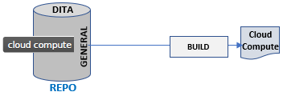

# Content Badging in OASIS DITA (SECOND REVIEW)

This repo contains draft content for an OASIS DITA Adoption whitepaper on content badging. 

<ul>
<li><a href="#usecases">A typical use case for content badging</a></li>
<li><a href="#logic">Establishing logic for your badges</a>
  <ul>
     <li><a href="#logic-global">Global statements about non-badged content</a></li>
  </ul>	 
</li>
<ul>

You can clone or download all the sample badges and the supporting DITA examples at:

`https://github.com/StanDoherty/dita-badges`.

The DITA map referencing stand-alone Markdown topics is `whitepaper_dita-badges.ditamap`. A PDF generated from those hybrid DITA/Markdown sources is available at:

Badging in general is a popular topic. The three most popular forms of badging are:

* *Achievement badging*: Organizations set up collections of social media "badges" to recognize the involvement and achievement of employees, partners, and customers. Imagine if someone developed a technical certification program for DITA and awarded badges to program participants who have passed tests for particular DITA features.  

      

* *Status badging*: Collaborative development platforms such as GitHub allow administrators to add macros to portal pages that display the current status of builds, workflow stages, contributions, and test coverage.

  
  
  

  

  

  
    
* *Content badging*: Content development organizations often decide to have one publication document multiple,  closely-related products. Content badges alert readers whether the relevance of a particular topic, section, or element is restricted to a specific product or release version. Here are some samples of icon-based and tag-based badges.

   This topic does not apply to Cloud Compute.

   This topic applies exclusively to Cloud Compute.

   This section does not apply to Cloud Compute.
  
   This topic applies exclusively to Cloud Compute. 

Content badging allows writing teams to "tag" content as applicable or inapplicable to a specific technology, product, release level, or audience. 
<a name="usecases"></a>

## A typical use case for content badging 

A startup named CloudSquared develops resource monitoring software for cloud-based frameworks. For its first product, Cloud Compute Monitoring, the content development team develops a complete documentation set.



A year later CloudSquared releases Cloud Net Monitoring so the content development team uses DITA conditional filtering to publish separate Cloud Compute and Cloud Net publications. 


Content developers assign filtering attributes such as `product="cloud-compute"` or `product="cloud-net"` to topics, sections, or elements that need to be filtered OUT of a product-specific deliverable. 

The following year, CloudSquared releases Cloud Connect and completes the monitoring suite. The writing team then uses conditional filtering to publish three separate publications. 


Content developers add the filtering attribute `product="cloud-connect"` to those topics, sections, or elements that need to be filtered OUT of the other two product-specific deliverables. 

Six months after this launch, Marketing receives feedback that emphasizing common design and services across the three suite components will enhance customer perception that CloudSquared can consolidate its achievements and move on to new product lines. Toward that end, Product Management requests that the content development team consolidate the three, product-specific publications into one, multi-product publication. Both generic and product-specific information would need to appear in the same deliverable.


When transitioning from conditional filtering to badging, note that filtering metadata is *useful* in identifying where product-specific information lives in your sources but *useless* as markup to implement badging. In DITA, the logic to include or exclude elements tagged with filtering attributes such as @product or @audience lives in DITAVAL scripts outside the DITA topics themselves.  

Filtering markup in a topic: 

```xml
<p product="cloud-connect">Cloud Connect is great.</p>
```

Filtering markup in a DITAVAL script:

```xml
<val>
   <prop att="product" val="cloud-compute" action="exclude" />
   <prop att="product" val="cloud-net" action="exclude" />
   <prop att="product" val="cloud-connect" action="include" />
</val>
```

DITA filtering does a brilliant job supporting a one-to-many relationship between source content and generated content. One DITA source topic tagged with multiple filtering attribute values can generate multiple, distinct versions of itself. The logic for content badging involves a one-to-one relationship between a source topic and its generated version. All the "badges" or badging metadata that you need to include in that one, multi-platform or multi-product version of a topic must be  included in the one source DITA topic *and* included in generated output topic.    

The logic that you used in designing DITA filtering is transferable to the logic for DITA content badging.
<a name="logic"></a>

## Establishing logic for your badges 

Incomplete or fuzzy standards around the logic of badging is the most frequent reason that it fails in content development organizations. Investing in crisp specifications with practical examples is critical. 
<a name="logic-global"></a>

### Global statements about non-badged content 

The first step toward providing logic for your publication is having a global statement about non-badged content.

> Unless otherwise indicated with a product badge such as , all content applies equally to CloudSquared Cloud Compute, Cloud Net, and Cloud Connect. 

This global statement sets the baseline logically. The only badges that the customer should expect to see would be ones that are exclusionary, identifying topics or sections that are *not* applicable to a particular product. The simpler your logic for inserting badges, the more consistently content developers can apply them and customers can understand them. In this scenario, you do not need to insert any inclusive badges, only exclusive ones. This is not unlike DITA filtering attributes that are designed, generally, to exclude content from processed output. 
  
 This topic does not apply to Cloud Compute.

 This section does not apply to Cloud Net.

 This topic does not apply to Cloud Connect.

In our use case, you would then require only six badges -- 3 products x 2 scopes (topic or section).

### Badging and scope 

When we content developers are working in our DITA editor and are identifying elements that we want to badge, we see where `<topic>` and `<section>` elements begin and end. We see the scope of the element relative to the topic displayed in our DITA editor. Unfortunately, these topic and section boundaries are neither visible nor recoverable to customers. In a running PDF, where does the current "topic" or "section" end? If we chunk multiple source topics so they generate one HTML5 page in output, wouldn't the topic boundaries be misleading? If I set a topic-level badge to indicate that no content in the topic applies to a particular product, what happens if another writer conref's a section from my topic? That conref'd section has no section badge. Messy stuff. 

There is no technical solution in the XML markup. Consider the following best practices when defining the scope of each badge.

1. Conduct formal tests of your content and the boundaries of what you want to badge. Use colored highlighters on paper to test your collective understanding and alignment. 

2. Avoid generic, unscoped badges. Design your badges to have a specific granularity (scope), for example by topic, by section/step, or by element.

   **Caution**: Although it is technically possible to create badges scoped to the level of DITA block and inline elements, many teams avoid granular badging for practical reasons -- maintenance.
 
   Practically, attempting to use the same badges for elements that you use for topics or sections can create a visual and logical train wreck. Teams that have successfully worked with badged documentation for multiple releases turn to `<note>` elements or in-line explanations for anything more granular than sections. Others use DITA flagging to color-code platform-specific, inline information.

1. Create and maintain formal specifications.   

## Badge design components

Logic and planning problems of this sort are best approached visually. Design exercises such as card sorting or affinitization depend upon multiple team members seeing all the variables and iteratively testing various arrangements or groupings. Similarly, making a first, complete pass at designing all the content badges that you might need will accelerate the process of developing and refining the logic of your badging. If you have time to code the badges in a DITA library, that's great -- but sticky notes or 3x5 cards will suffice for team discussions early on. Move the cards around. Tape them to whiteboards. Staple them to printouts of your existing docs. Any exercise that simulates you applying a badge to your content and then asking whether that makes sense is goodness.

Although there are multiple ways to implement content badging in DITA, the badges themselves share  some common building blocks:

Visual cue | Content ID | Content scope | Text (switch) | Flagging attribute
-----------|------------|---------------|---------------- | ----
<br />|Cloud Net|This section | applies to . . . | @product
<br />|Cloud Net|This topic  | does not apply to . . . | @product


## Badge implementation options 

Once you have identified your design components. There are two general approaches for implementing badges, DITA flagging and DITA library references. They are not, by the way, mutually exclusive. 

### DITA flagging 
  
If you can "badge" content variations with *either* an icon *or* a text string, DITA flagging is the recommended approach. Define these flagging badges in your DITAVAL files. 

```xml
<val>
  <!-- The following two badges insert an icon at the beginning of the flagged content -->
  <!-- with the alt-text string appearing as hover or alt-reader text. -->    
  <prop att="product" action="flag" val="cloud-compute-yes-section">
      <startflag imageref="images/badge_cloud-compute-yes-section.png">
        <alt-text>This section applies to the CloudSquared Cloud Compute product.</alt-text>
      </startflag>
  </prop>
  <prop att="product" action="flag" val="cloud-compute-no-section">
      <startflag imageref="images/badge_cloud-compute-no-section.png">
        <alt-text>This section does not apply to the CloudSquared Cloud Compute product.</alt-text>
      </startflag>
  </prop>

  <!-- The next two badges insert the alt-text string at the beginning of the flagged content. -->
  <prop att="product" action="flag" val="cloud-net-yes-section">
      <startflag>
        <alt-text>[Cloud Net supported] </alt-text>
      </startflag>
  </prop>
  <prop att="product" action="flag" val="cloud-net-no-section">
      <startflag>
        <alt-text>[Cloud Net not supported] </alt-text>
      </startflag>
  </prop>
</val>

```

DITA flagging has the additional benefit of supporting multiple values for flagging attributes. In the following example, the <p> element is badged for both cloud-compute-yes-section and cloud-net-yes-section.    

```xml
<p product="cloud-compute-yes-section cloud-net-yes-section">
Contact Customer Support for Patch-2019-2335.
</p>
```
 
DITA processors *should* generate two instances of the badge icon or badge text at the beginning of the targeted element. This technique may be the only way with DITA flagging to generate *both* an icon and a text message.    

### DITA library references 

DITA flagging is preferable, but not possible in all circumstances:

* Your legacy CCMS does not support flagging.
* The transforms that you use are buggy or do not support flagging.
* You do not have control over your DITAVAL files or publishing pipeline.
* Some of your sources are in non-XML formats such as Markdown or HTML5.     

The brute-force method of building libraries of content badges and then referencing them from your DITA topics is an option.
 
Start by building a library of reusable DITA badges, call it `library_content-badges.dita`. 

Here is some markup for a positive badge . . .

```xml
<p id="p_badge_icon_cloud-connect_section_yes">
    <image href="images/badge_cloud-connect_small_yes.png">  
      <alt>This section applies exclusively to Cloud Connect.</alt>
    </image>
    <ph> This section applies exclusively to Cloud Connect.</ph>
</p>
```

. . . and generates


The following markup defines a negative badge . . . 

```xml
<p id="p_badge_tag_cloud-compute_topic_no">
  <image href="images/tag_cloud-compute_not-supported.svg">
    <alt>This topic does not apply to Cloud Compute.</alt>
  </image>
  <ph> This topic does not apply to Cloud Compute.</ph>
</p>
```
. . . and generates 


Time that you spend organizing these badge definitions in a DITA library topic has a big payoff for content developers on your team. If writers can easily find the appropriate badge, they'll thank you -- eventually.  


## Going on a test drive 

Once you have normed on your logic and authoring guidelines, apply them to a small publication. Badging is messy stuff and you do not want to implement it for a complete doc set until you have tested it out received a "go-ahead" from your stakeholders. When they actually see a sample of your "badged" documentation, they may have objections or concerns that you had not factored into your initial design. 

* *UXD*: "Shouldn't the graphic design of the badges conform to the new company UX guidelines?"
* *Support*: "Some customers are not careful readers and tend to ignore subtleties like these badges. They try something that is not appropriate for their product and then call us. Why are we doing this again? It is increasing our workload."
* *Test engineering*: "When we tested your procedures in the product-specific manuals, we could clearly identify issues with your writing. The new format is interesting, but we are never quite sure whether we are supposed to be testing all product procedures at once or be tiptoeing through the product-specific procedures one at a time." 
* *Software engineering*: "Sometimes the differences between product features are not binary, not quite so simple as 'supported' or 'not supported'. Some features are "minimally supported" or "mostly supported." 
* *Sales*: In pre-sales discussions, handing prospective customers a manual that documents three products kinda confuses them if they are interested in buying only one."
* *Marketing*: "I didn't realize that the docs would need so many badges. Can you make them smaller or put them in the margin somewhere?"
* *Legal*: "Our product documentation serves as the definitive product description. If the documentation does not accurately describe the product that the customer has purchased, we cannot recognize revenue."

Showing everyone a robust sample of badged documentation generates discussion across the organization about badging and other requirements for product documentation. 

## Badge placement options 

Where you tag or insert badge references is part common sense and part team preference. 

### Attribute tagging for DITA flagging

If you are using DITA flagging to implement badging, you need to place the flagging attribute value in the first content-bearing element of the "badged" content. 

```xml
<body>
  <p product="cloud-net-yes-body">First paragraph.</p>
  <p>Running text</p>
</body>
```

```xml
<section>
  <title>Security considerations</title>
  <p product="cloud-net-yes-section">Running text</p>
</sections>
```

Tagging non-content-bearing elements such as <body> or <section> will not generate flagged (badged) output. 
 
 
### Library references for topics

The same principle applies to inserting references to badging libraries. 

The following markup places the badge in the first sentence of the body of the topic.

```xml
<topic id="test1">
  <title>Topic title</title>
  <shortdesc>Short description</shortdesc>
  <body>
   <p conref="library_content-badges.dita#badge-lib/p_badge_tag_cloud-compute_topic_no"/>
   <p>Running text.</p>
  </body>
</topic>
```

The following markup places the same badge inside the `<abstract>` element at the beginning of the topic.

```xml
<topic id="test2">
  <title>Topic title</title>
  <abstract>
    <shortdesc>Short description</shortdesc>
    <p conref="library_content-badges.dita#badge-lib/p_badge_tag_cloud-compute_topic_no"/>
  </abstract>
  <body>
    <p>Running text</p>
  </body>
</topic>
```

### Library references for sections

The following markup places the badge in the first sentence of the `<section>`.

```xml
<section>
  <title>Section title</title>
  <p>Section-level badge reference</p>
  <p>Running text</p>
</section>
```
In this case, consistency is the important thing.

### Conref and keyref references to badge libraries

If you have built a library for your badges and assigned each of them a unique ID, you can use @conref or @conkeyref to insert them by reference them into your current topic. 

Let's assume that you have created a badging library named `library_content-badges.dita` with a topic @id of `library1`. That library contains the following badge definition.  

```xml
<p id="p_badge_tag_cloud-compute_topic_yes">
  <image href="images/tag_cloud-compute_supported.svg">
    <alt>This topic applies exclusively to Cloud Compute.</alt>
  </image>
  <ph> This topic applies exclusively to Cloud Compute.</ph>
</p>
```

To insert this badge using @conref (URL referencing), you would enter the following markup.

```xml
<p conref="library_content-badges.dita#library1/p_badge_tag_cloud-connect_topic_yes"/>
```

To insert this badge using DITA keys, you must first define a key for the badging library in your current map.

```xml
<topicref keys="badgelib" href="library_content-badges.dita"/>
```

You can then reference the badge using @conkeyref (indirect referencing).

```xml
<p conkeyref="badgelib/p_badge_tag_cloud-connect_topic_yes"/>
```

The @conref and @conkeyref mechanisms reference the same badge definition in the same badge library file. Using indirect, key-based references is a wise investment because it will provide you with flexibility in managing multiple badge library files down the road. Change the key definition once, all @conkeyref references inherit the new badge definition automatically.

### Conref/keyref push references to badge libraries

What happens when the badged topics that support your three-product context get referenced by someone from another product group? At a minimum, they'll get a build error (missing key or reference). Ultimately their customers will not understand what is going on. 

Be practical. Badging is a work-around and will not scale beyond a workgroup. Clone the shared topic, remove the badges from the clone, and move on.

If you *must* share a badged topic across teams but do not want the badges to appear in all contexts, consider one of the more underutilized reuse mechanisms in DITA, conref push. 

By default, @conrefs and @conkeyrefs "pull" referenced content into the current topic. Conref push and conkeyref push (insert) referenced content into a specific location in a target topic. 

For example, let's say that a topic named `Untitled1.dita` contained the following section.

```xml
<section>
  <title>Conref push example</title>
  <p id="p_first-para">The badge should be inserted above this paragraph. </p>
  <p>. . . </p>
</section>
```

In its current state, this markup generates the following output.


To "push" a section-level badge into a target topic named `Untitled1.dita`, you need to create a separate topic that defines what you want to push into the target topic and where it should be inserted. Let's call that topic `conrefpush.dita`. 


Set the @processing-role attribute of `conrefpush.dita` to "resource-only" in the map so the conref push topic does not appear alongside other content topics. 


Setting this attribute makes `conrefpush.dita` available to the DITA map and to the DITA processor, but not visible to the customer.  

To "push" a badge into `Untitled1.dita` before the section paragraph with `@id="first-para"`, insert the following markup into `conrefpush.dita`. 

```xml
<p conaction="pushbefore">
  <image href="images/badge_cloud-compute_small_yes.png">
    <alt>This topic applies exclusively to Cloud Compute.</alt>
  </image>
  <ph> This topic applies exclusively to Cloud Compute.</ph>
</p>
<p conaction="mark" conref="Untitled1.dita#untitled/p_first-para" />
```

Before build time, you see no change in target topic content. At build time, the paragraph with `conaction="pushbefore"` instructs the DITA processor to insert the badge defined in this paragraph *before* a target paragraph element. The second paragraph specifies that target element (insertion point) as `<p id="p_first-para"> The badge should be inserted above this paragraph.</p>`. The processed output now includes a badge that was never inserted directly into the topic. 


This would be the location where you would insert a section-level badge manually. If another team references `Untitled1.dita` without referencing `conrefpush.dita`, the badge never appears in their generated output.  

Conref push is an acquired taste. You need to weigh the benefits of implementing conref push against the complexity that it introduces. Some technical solutions create more governance problems than they are worth. 

## Conclusion

If your organization has a business need to consolidate multiple, related publications into one multi-platform or multi-product publication, then you may find many of these best practices for content badges to be useful.  

OASIS DITA Adoption Technical Committee
