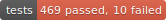
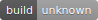
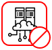
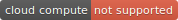

# Content Badging in OASIS DITA (SECOND REVIEW)

This repo contains draft content for an OASIS DITA Adoption whitepaper on content badging. 

You can clone or download all the sample badges and the supporting DITA examples at:

`https://github.com/StanDoherty/dita-badges`.

The DITA map referencing stand-alone Markdown topics is `whitepaper_dita-badges.ditamap`. A PDF generated from those hybrid DITA/Markdown sources is available at:

Badging in general is a popular topic. The three most popular forms of badging are:

* *Achievement badging*: Organizations set up collections of social media "badges" to recognize the involvement and achievement of employees, partners, and customers. Imagine if someone developed a technical certification program for DITA and awarded badges to program participants who have passed tests for particular DITA features.  

      

* *Status badging*: Collaborative development platforms such as GitHub allow administrators to add macros to portal pages that display the current status of builds, workflow stages, contributions, and test coverage.

  
  
  

  

  

  
    
* *Content badging*: Content development organizations often decide to have one publication document multiple,  closely-related products. Content badges alert readers whether the relevance of a particular topic, section, or element is restricted to a specific product or release version. Here are some samples of icon-based and tag-based badges.

   This topic does not apply to Cloud Compute.

   This topic applies exclusively to Cloud Compute.

   This section does not apply to Cloud Compute.
  
   This topic applies exclusively to Cloud Compute. 

Content badging allows writing teams to "tag" content as applicable or inapplicable to a specific technology, product, release level, or audience. 
